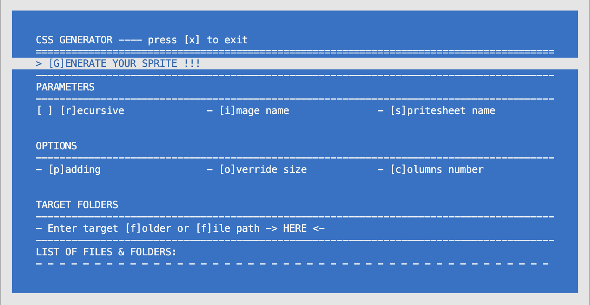

# Sprites Generator

Sprites generator is a PHP script that allows you to bundle selected images together into one sprite for web use. An HTML file as well as a CSS sheet are also generated, containing all selected images coordinates within the sprite image for you to use on your website.
I made this project as my first ever OOP PHP project after I started my web development journey.

### Project restrictions
- We were not allowed to use the scandir function or any RecursiveIterator classes

### Things I learned making this project
- Purpose and Usage of classes and OOP in general
- Parsing parameters
- File management in PHP
- Recursive functions
- Usage of PHP-School's CLI menu

### Pre-requisites
PHP installed, as well as Composer

## Installation
Clone the repo to get started.

### CLI UNIX style
Open the repo folder in a terminal, then type the following
```sh
php css_generator.php [OPTIONS]... assets_folder
```
You can target multiple assets folders as well as image files. Just separate them with a space.

[OPTIONS] are :
| Short Option | Long Option | Description |
| ------ | ------ | ------ |
|-r | --recursive | Look for images into the assets_folder passed as arguement and all of its subdirectories.|
|-i | --output-image=IMAGE | Name of the generated image. If blank, the default name is « sprite.png ».|
|-s | --output-style=STYLE | Name of the generated stylesheet. If blank, the default name is « style.css ».|
|-p | --padding=NUMBER | Add padding between images of NUMBER pixels. |
|-o | --override-size=SIZE | Force each images of the sprite to fit a size of SIZExSIZE pixels.|
|-c | --columns_number=NUMBER | The maximum number of elements to be generated horizontally.|

### CLI Menu
Open the repo folder in a terminal, cd inside the "GUI" folder then type the following
```sh
composer install
```

To start the script, type
```sh
php menu.php
```

You should see this menu


Navigate through it with your keyboard arrows or with the shortcut letters between [] for each option.
Don't forget to target files or folders.


Have fun generating your sprites !

## License
MIT